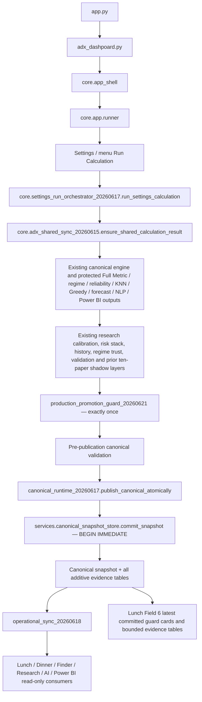

# Architecture — Production Promotion Guard

## Traced runtime

## Protected authorities

- Sole directional authority: the existing canonical decision engine.
- Shared calculation: `core/adx_shared_sync_20260615.py::ensure_shared_calculation_result`.
- One-click transaction: `core/settings_run_orchestrator_20260617.py::run_settings_calculation`.
- Atomic publisher: `core/canonical_runtime_20260617.py::publish_canonical_atomically` and `services/canonical_snapshot_store.py::commit_snapshot`.
- Full Metric and ten-decision display authority: Lunch Field 1 in `ui/lunch_four_core_fields_20260619.py` and its existing shared renderers/history stores.
- The guard receives a deep copy of completed canonical outputs and publishes no action/direction key.

## Six existing Lunch fields preserved

1. Full Metric 25-Day History + Decision Tables.
2. Power BI Price Prediction Path.
3. 25-Day Regime History + Lower / Medium / Higher Standards.
4. Dinner Full Combined Intelligence.
5. Grounded AI Assistant.
6. Future Strategy Research History, now containing concise guard cards and detailed read-only evidence.

## One consolidated guard

`production_promotion_guard_20260621.py` orchestrates the ledger, SPIBB/HCOPE/DR, anchor robustness, HSMM duration validation, VaR/ES/CVaR/CDaR, constrained sizing and promotion registry. These are validators and risk gates, not ten decision engines.
